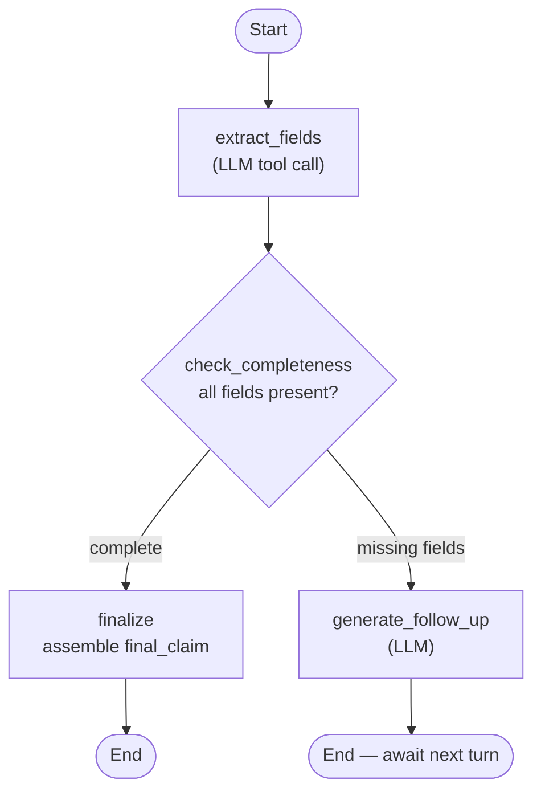
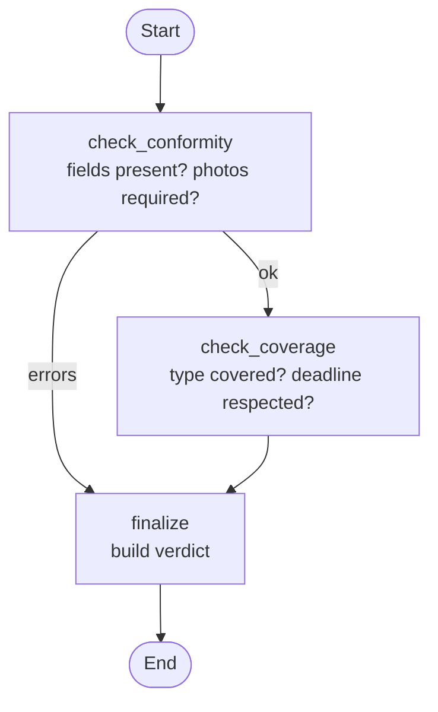

# Agent Graphs

## Declaration Agent

**Input:** policyholder message  
**Output:** `final_claim` — `{date, incident_type, description, has_photos, photo_filenames, conversation_history}`  
**Model:** Qwen2.5-7B-Instruct (tool calling + text generation)

---

## Validation Agent

**Input:** `final_claim` from Declaration Agent + `today_override` (optional)  
**Output:** `verdict` — `{status, reason, coverage, claim}`  
**Model:** none — pure rule-based
